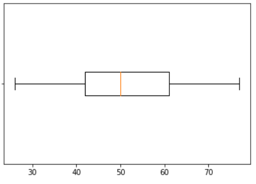
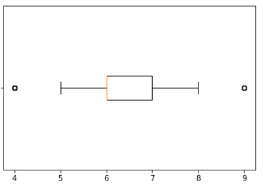
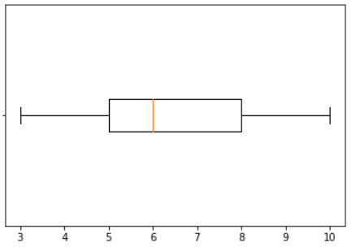
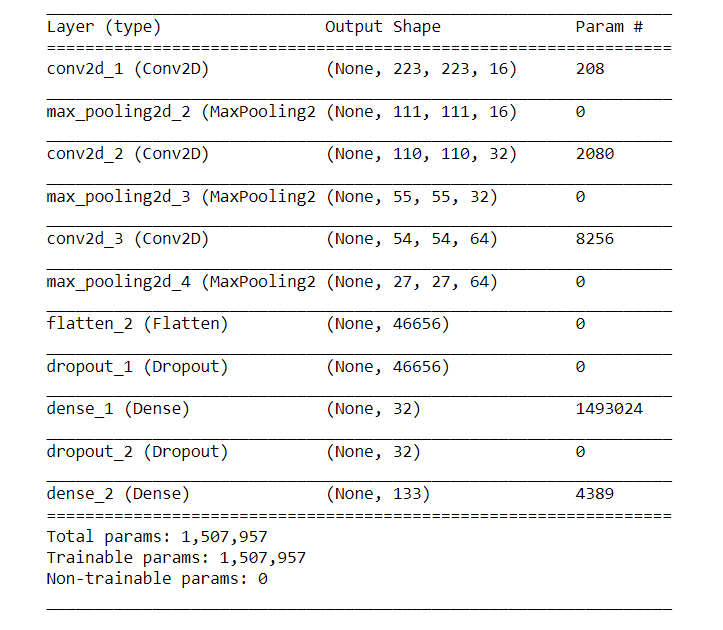
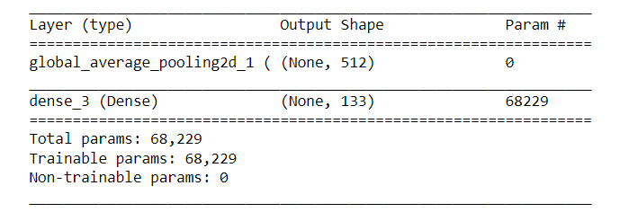
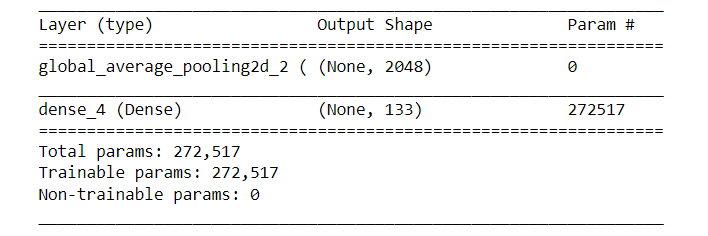
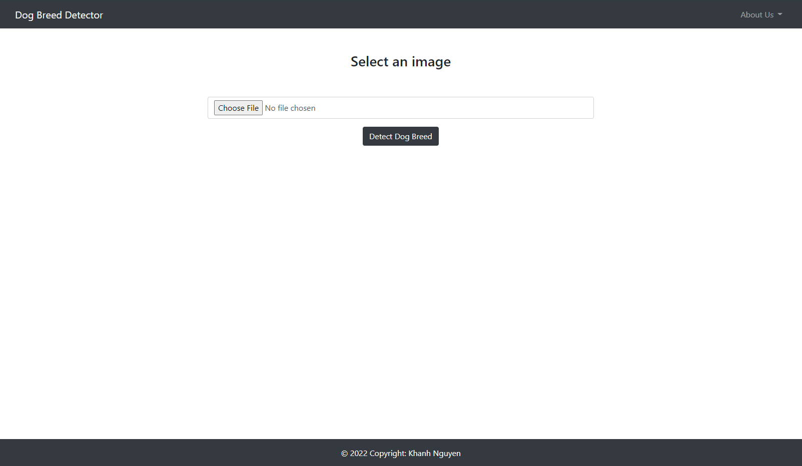
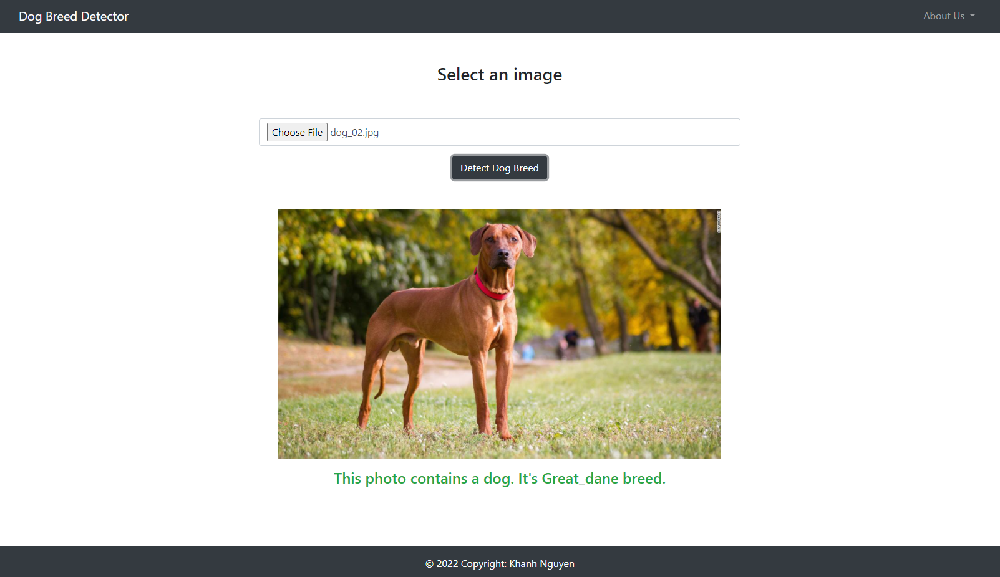
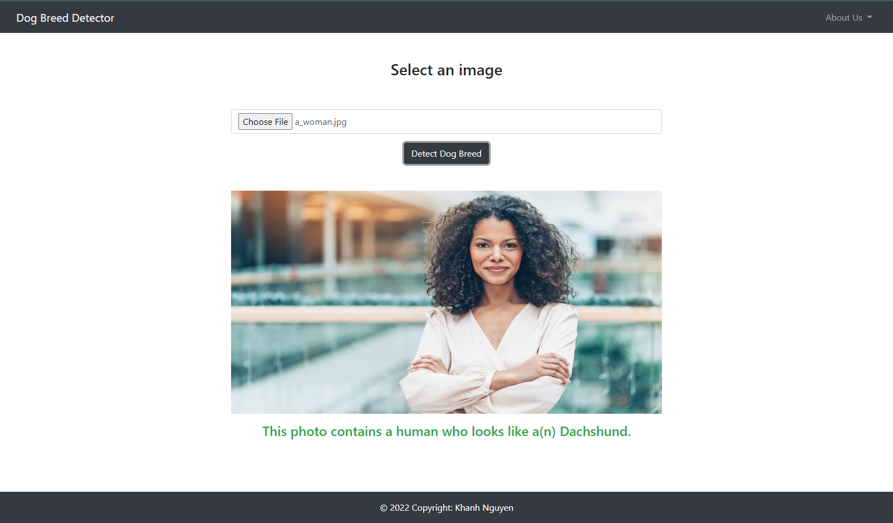
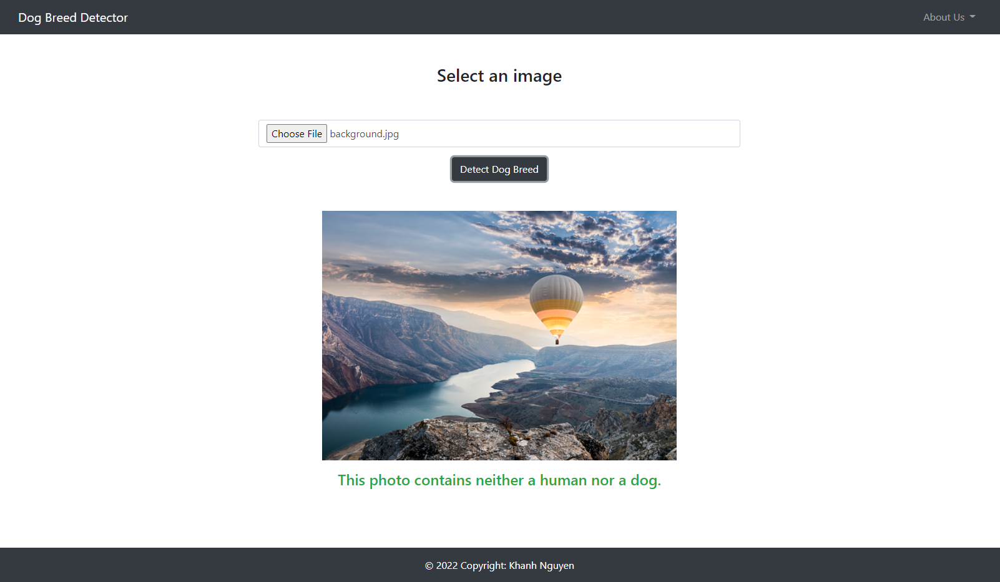

# Dog Breed Classifier with Convolutional Neural Networks

## Table of Contents

1. [Project Definition](#project-definition)
    * 1.1 [Project Overview](#project-overview)
    * 1.2 [Problem Statement](#problem-statement)
    * 1.3 [Metrics](#metrics)
    * 1.4 [Exploratory Data Analysis](#EDA)    
    * 1.5 [Data Preprocessing](#preprocessing)
    * 1.6 [Modeling](#modeling)
    * 1.7 [Hyperparameter tuning](#tuning)
    * 1.8 [Results](#results)
    * 1.9 [Conclusion/ Reflection](#conclusion)
    * 1.10 [Improvements](#improvements)

2. [Requirements](#requirements)
3. [File Descriptions](#file-descriptions)
4. [How to run](#how_run)
5. [Licensing, Authors, and Acknowledgements](#licensing)

## 1. Project Definition <a name='project-definition'></a>
## 1.1 Project Overview <a name='project-overview'></a>

Welcome to the dog breed classifier project. In this project, you will build a pipeline to process real-world, user-supplied images. Given an image of a dog, your algorithm will identify an estimate of the canine’s breed. If supplied an image of a human, the code will identify the resembling dog breed.


## 1.2 Problem Statement <a name='problem-statement'></a>

Our task is to build a web app that classifies the dog breeds if an image contains a dog or the resembling dog breed if an image contains a human. The problem we want to solve in the project is a multi-class classification. This project uses Convolutional Neural Networks (CNNs). The output layer of the neural network has 133 classes, one class for each dog breed in the dataset.

This project consists of the following steps:
* Exploratory Data Analysis
* Detect any human faces in the image by OpenCV's implementation of Haar feature-based cascade classifiers.
* Detect any dogs in the image by a pre-trained ResNet-50 model.

* Classify dog breeds. W will try two CNN models to find the best ones:
    - Building CNN model from scratch
    - Building CNN model using transfer learning: VGG16
    - Building CNN model using transfer learning: InceptionV3

* We use the training data to train our model and validate the performance using the validation dataset according to metrics. We then select the best performance model and save it.

* Finally, we build a Flask app to detect dogs and humans from the input images by users.

## 1.3 Metrics <a name='metrics'></a>

In this project, we choose the accuracy metric to measure the performance of a model because it is often used in a classification problem and works well for the well-balanced dataset as ours. It simply measures how often the classifier correctly predicts. We can define it as the ratio of the number of correct predictions and the total number of predictions.

<div style="text-align:center">

</div>

## 1.4 Exploratory Data Analysis <a name='EDA'></a>

Dataset has 8351 total color dog images. We will split it into training, validation, and testing datasets. 

The training dataset contains a total of 6680 images of 133 dog breeds. The number of images for each one is well balanced from 26 to 77.

<div style="text-align:center">

<p><i>Figure: Number of images for each dog breed in the train dataset.</i></p>
</div>

The valid dataset contains total of 835 images of 133 dog breeds, the number images of each one are quite balanced from 4 to 9 images.

<div style="text-align:center">

<p><i>Figure: Number of images for each dog breed in the valid dataset.</i></p>
</div>

The test dataset contains a total of 835 images of 133 dog breeds, each one has from 3 to 10 images.
<div style="text-align:center">

<p><i>Figure: Number of images for each dog breed in the test dataset.</i></p>
</div>

## 1.5 Data Preprocessing <a name='preprocessing'></a>
1. Detect Humans

Before using any of the face detectors, it is standard procedure to convert the images to grayscale. We should convert color images to grayscale by OpenCV (cv2) library.

2. Detect Dogs

When using TensorFlow as the backend, Keras CNNs require a 4D array (which we'll also refer to as a 4D tensor) as input. Therefore, we need to preprocess color images to 4D tensors.
Firstly, we resize images to a square image that is  224×224  pixels. Next, the image is converted to an array. Finally, it is resized to a 4D tensor. 

In this case, since we are working with color images, each image has three channels. After preprocessing a single image, the returned tensor will always have a shape (1,224,224,3).


To use ResNet-50 model for detecting humans, we need some additional processing. First, the RGB image is converted to BGR by reordering the channels. All pre-trained models have the additional normalization step that the mean pixel (expressed in RGB as  [103.939,116.779,123.68]  and calculated from all pixels in all images in ImageNet) must be subtracted from every pixel in each image. This is implemented in the imported function `preprocess_input` of `keras.applications.resnet50`


## 1.6 Modeling <a name='modeling'></a>

1. Detecting humans

We use OpenCV's implementation of Haar feature-based cascade classifiers to detect human faces in images. OpenCV provides many pre-trained face detectors. In this project, we use haarcascades pre-trained face detectors stored as `haarcascades/haarcascade_frontalface_alt.xml`.

After preprocessing a color image to grayscale, we execute `detectMultiScale()` function. It returns 1D array with four entries [x, y, w, h], which specifics faces position as:

*  x: the horizontal positions of the top left corner of the bounding box
*  y: the vertical positions of the top left corner of the bounding box
* w: the width of the box
* h: the height of the box


2. Detecting Dogs

We use a pre-trained `ResNet-50` model to detect dogs in images with weights that have been trained on [ImageNet](http://www.image-net.org/), a very large, very popular dataset used for image classification and other vision tasks. ImageNet contains over 10 million URLs, each linking to an image containing an object from one of [1000 categories](https://gist.github.com/yrevar/942d3a0ac09ec9e5eb3a). 

After preprocess image, we use `predict()` fucntion, which returns an array whose  i -th entry is the model's predicted probability that the image belongs to the  i -th ImageNet category. While looking at the [dictionary](https://gist.github.com/yrevar/942d3a0ac09ec9e5eb3a), you will notice that the categories corresponding to dogs appear in an uninterrupted sequence and correspond to dictionary keys 151-268, inclusive, to include all categories from 'Chihuahua' to 'Mexican hairless'.


3. Classifying Dog Breeds

For classifying dog breeds, we try the three below CNN models to find the best one:
- Building CNN model from scratch
- Building CNN model using transfer learning: VGG16
- Building CNN model using transfer learning: InceptionV3

3.1 CNN model from scratch without transfer learning

The network begins with a sequence of three convolutional layers, followed by the Max pooling layers. The first layer has `input_shape=(224, 224, 3)` because the size of the images is 224 by 224 with three color channels (RGB). These first six layers are designed to take the input array of image pixels and convert it to an array where all of the spatial information has been squeezed out, and only information encoding the content of the image remains.

Next is the Flatten layer to flatten the array to a vector.

Then, we use two dense layers to further elucidate the content of the image, preceded by drop layers to prevent overfitting. The final layer has 133 nodes, one entry for each dog breed in the dataset, and has a softmax activation function to convert the scores from the output into probability values.

<div style="text-align:center">

</div>

3.2 CNN model using transfer learning: VGG16

The model uses the pre-trained VGG-16 model as a fixed feature extractor, where the last convolutional output of VGG-16 is fed as input to our model. We only add a global average pooling layer and a fully connected layer, where the latter contains one node for each dog category and is equipped with a softmax.

<div style="text-align:center">

</div>

3.3 CNN model using transfer learning: InceptionV3

Firstly, we choose the InceptionV3 as a pre-trained CNN. It has a total of 42 layers in 5 parts: Factorized Convolutions, Smaller convolutions, Asymmetric convolutions, Auxiliary classifier, and Grid size reduction. In comparison to VGGNet, Inception Networks have proved to be more computationally efficient, both in terms of the number of parameters generated by the network and the economical cost incurred (memory and other resources).

Next is the GlobalAveragePooling2D layer. That takes 4D tensor (output of pre-trained CNN) as input and then returns 2D tensor by applying average pooling on the spatial dimensions.

Finally, the Dense layer has a softmax activation function to convert the scores from the output into probability values, and 133 nodes, one node for each dog breed in the dataset.

<div style="text-align:center">

</div>


In both above models, we use `categorical_crossentropy` loss for multi-class classification and `rmsprop` for the optimizer when compiling model.


## 1.7 Hyperparameter tuning <a name='tuning'></a>

For hyperparameter tuning, we use `ModelCheckpoint` of `keras.callbacks` with 15 epochs to track accuracy and loss. We save the best model, which has the best validation loss, into a file.


## 1.8 Results <a name='results'></a>

The first model (CNN model from scratch) has the best parameters with 4.1654 valid loss, 7.42% test accuracy.

The second model (CNN model with the pre-trained VGG-16 model) has the best parameters with 8.5381 valid loss, 41.15% test accuracy.

The third model (CNN model with the pre-trained InceptionV3 model) has the best parameters with 0.6662 valid loss, 80.14% test accuracy.

The second and third model is so much better than the first one because of transfer learning. The third model is better than the second one because the InceptionV3 works better than VGG16 in our dataset. The Inception v3 is an image recognition model that has been shown to attain greater than 78.1% accuracy on the ImageNet dataset. It is made up of symmetric and asymmetric building blocks, including convolutions, average pooling, max pooling, concatenations, dropouts, and fully connected layers. Batch normalization is used extensively throughout the model and applied to activation inputs. 

## 1.9 Conclusion/ Reflection <a name='conclusion'></a>

We have already classified dog breeds using Convolutional Neural Networks. We detect human faces with Haar feature-based cascade classifiers and dogs with ResNet-50 transfer learning. Finally, we classify dog breeds by CNN models with and without transfer learning VGG16 and Inception V3.
After working on this project,  I think it is difficult to build a model with acceptable accuracy to classifier images without using transfer learning.

## 1.10 Improvements <a name='improvements'></a>

I think we can improve performance by adding something as below to the third model (CNN using InceptionV3 transfer learning).

* Adding Augmentation layer to improve performance and outcomes of machine learning models by forming new and different examples to train datasets such as flipping, and rotating images.

* Adding more Dense layers with Drop layers which helps improve accuracy while preventing overfitting.

* Increasing epoch and using EarlyStopping to monitor metrics, stop training at the point when performance on a validation dataset starts to degrade.

## 2. Requirements
This project should be run with these following libraries
- opencv-python==3.2.0.6
- h5py==2.6.0
- matplotlib==2.0.0
- numpy==1.12.0
- scipy==0.18.1
- tqdm==4.11.2
- keras==2.0.2
- scikit-learn==0.18.1
- pillow==4.0.0
- ipykernel==4.6.1
- tensorflow==1.0.0
- flask
- bootstrap
- ajax

## 3. File Descriptions
Here's the file structure of the project:
```
- app
|   - static
|   |   - uploaed_imgs                  # stores uploaded images
|   - templates
|   |   - index.html                    # main page of web app
|   - dog_breed_detector                # contains function to detect dog breed
|   - run.py                            # contains routers and runs app

- build_models
|   - dog_app.ipynb                     # jupyter notebook to build model
|   - dog_app.html                      # result of dog_app.ipynb
|   - images                            # stores static images of dog_app.ipynb

- haarcascades
|   - haarcascade_frontalface_alt.xml   # pre-trained face detector

- saved_models                          # storages the best trained models 
|   - weights.best.from_scratch.hdf5    
|   - weights.best.InceptionV3.hdf5     # be used for classify dog breed in app
|   - weights.best.VGG16.hdf5

- static                                # images for README.md file
- README.md
```

## 4. How to run <a name='how_run'></a>
1. Run dog_app.ipynb to build models.

2. Go to app directory: 
```
cd app
```

3. Run your web app:   
```
python run.py
```

4. Go to http://0.0.0.0:3001/


    Web app Screenshots:










## 5. Licensing, Authors, and Acknowledgements <a name='licensing'></a>
Thanks Udacity for great project!